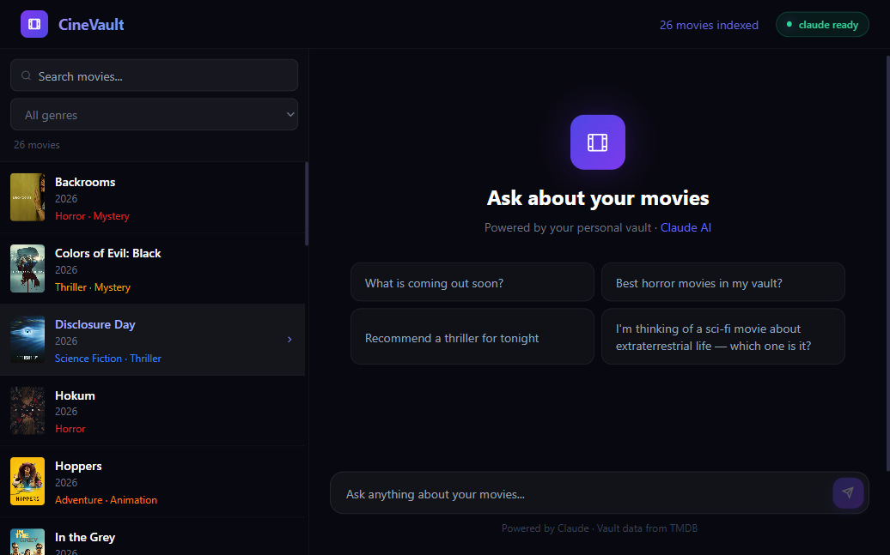
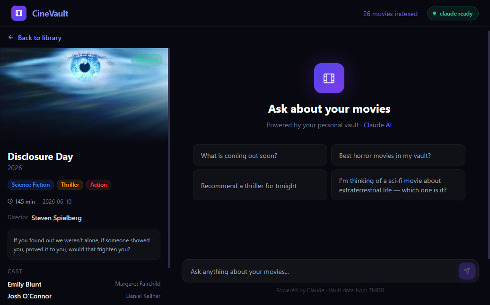
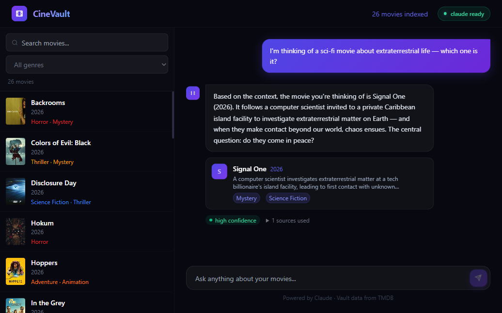

# CineVault

**Your personal movie intelligence system.** CineVault fetches real movie data from TMDB, stores it as searchable Obsidian Markdown notes, indexes everything into a local vector database, and lets you ask natural-language questions answered by Claude AI — all without an API key.

---

## Screenshots

| Movie Library | Movie Detail | AI Chat |
|---|---|---|
|  |  |  |

---

## What it does

- **Fetches** upcoming, trending, and popular movies from TMDB (+ optional OMDb ratings)
- **Stores** each movie as a structured Markdown note in an Obsidian vault — director, cast, synopsis, ratings, poster URL, and more
- **Indexes** every note into ChromaDB using local sentence embeddings (no external API, runs on CPU)
- **Answers questions** by retrieving the top relevant chunks and feeding them to Claude via the Claude Code CLI
- **No Anthropic API key required** — uses your existing Claude Code subscription via `claude -p`

### You can ask things like

- *"What sci-fi movies are coming out this year?"*
- *"Recommend a thriller for tonight"*
- *"I'm thinking of a movie about a scientist who discovers aliens — which one is it?"*
- *"Who directed the most anticipated horror film in my vault?"*

---

## Architecture

```
fetcher.py          →   vault/movies/*.md   →   indexer.py   →   chroma_db/
(TMDB / OMDb API)       (Obsidian Markdown)     (ChromaDB)        (vectors)
                                                                       ↓
                              React UI   ←   Node.js server   ←   search.py
                           src-frontend/       server/           (top-K chunks)
                                                  ↓
                                          spawn('claude -p')
                                          (Claude Code CLI)
```

**RAG flow per query:**
1. User question → `search.py` embeds it and queries ChromaDB → top-5 relevant movie chunks
2. Chunks are injected into a prompt and sent to `claude -p --output-format json`
3. Claude returns structured JSON: `{ answer, movies[], sourcesUsed[], confidence }`
4. React frontend renders the answer with inline movie cards, confidence badge, and source list

**Why ChromaDB instead of full-context loading?**  
Loading an entire movie vault into every Claude prompt doesn't scale. ChromaDB retrieves only the 5 most relevant chunks, so the system handles thousands of movies efficiently.

---

## Tech Stack

| Layer | Technology |
|---|---|
| Movie data | [TMDB API](https://www.themoviedb.org/documentation/api), [OMDb API](https://www.omdbapi.com/) (optional) |
| Vault storage | Markdown + YAML frontmatter (Obsidian-compatible) |
| Vector DB | [ChromaDB](https://www.trychroma.com/) (local, persistent) |
| Embeddings | `sentence-transformers/all-MiniLM-L6-v2` (local, CPU) |
| LLM | [Claude Code CLI](https://claude.ai/code) via `claude -p` |
| Backend | Node.js + Express + TypeScript (tsx) |
| Frontend | React 19 + Vite + Tailwind CSS v3 |
| MCP Server | `@modelcontextprotocol/sdk` — exposes vault as Claude tools |

---

## Prerequisites

- [Claude Code](https://claude.ai/code) installed and authenticated (`claude --version`)
- Python 3.10+
- Node.js 18+
- API keys: [TMDB](https://www.themoviedb.org/settings/api) (required), [Trakt](https://trakt.tv/oauth/applications) (optional), [OMDb](https://www.omdbapi.com/apikey.aspx) (optional)

---

## Setup

### 1. Clone and configure

```bash
git clone https://github.com/JoshKerosh/cinevault.git
cd cinevault
cp .env.example .env
```

Fill in `.env`:

```env
TMDB_API_KEY=your_tmdb_api_key        # required
TRAKT_CLIENT_ID=your_trakt_client_id  # optional
OMDB_API_KEY=your_omdb_key            # optional (free tier requires Patreon)
```

### 2. Python environment

```bash
# Windows
py -m venv .venv
.venv\Scripts\activate

# macOS / Linux
python3 -m venv .venv
source .venv/bin/activate

pip install -r requirements.txt
```

### 3. Node dependencies

```bash
cd server && npm install && cd ..
cd src-frontend && npm install && cd ..
```

---

## Running

Open four terminals (or use a process manager):

```bash
# Terminal 1 — fetch movie data
python fetcher.py

# Terminal 2 — build vector index
python indexer.py

# Terminal 3 — start backend  (http://localhost:8787)
cd server && npm run dev

# Terminal 4 — start frontend (http://localhost:5173)
cd src-frontend && npm run dev
```

Then open **http://localhost:5173** and start asking questions.

> **First run:** `fetcher.py` downloads ~20–50 movies. `indexer.py` embeds them into ChromaDB (downloads the ~90 MB `all-MiniLM-L6-v2` model on first run, cached after that). Together they take 1–3 minutes.

---

## Claude Code Commands

With the project open in Claude Code, you can use these slash commands:

| Command | What it does |
|---|---|
| `/ingest` | Re-fetches trending movies and rebuilds the vector index |
| `/ingest --upcoming` | Fetches upcoming movies only |
| `/query What horror movies are in my vault?` | Semantic search + AI answer in the terminal |
| `/lint` | Validates all vault notes for missing fields and broken links |

---

## MCP Server

CineVault exposes the vault as an MCP server, letting Claude Code use it as a tool source:

```bash
cd server && npm run mcp
```

Add to your Claude Code MCP config (`~/.claude/mcp_servers.json`):

```json
{
  "cinevault": {
    "command": "node",
    "args": ["/absolute/path/to/cinevault/server/mcp.ts"],
    "env": {}
  }
}
```

Available tools: `search_vault`, `get_movie`, `list_movies`, `get_upcoming`.

---

## Vault Format

Each movie is stored as `vault/movies/Title (Year).md`:

```markdown
---
title: Disclosure Day
year: 2026
genres: [Science Fiction, Thriller, Action]
runtime_minutes: 145
director: Steven Spielberg
cast: ["Emily Blunt as Margaret Fairchild", "Josh O'Connor as Daniel Kellner"]
status: Released
release_date: 2026-06-10
poster_url: https://image.tmdb.org/t/p/w500/...
ratings:
  imdb: 8.2
  rotten_tomatoes: 94
---

## Synopsis
...

## Cast
...
```

The vault is fully Obsidian-compatible — open `vault/` as an Obsidian vault to browse, tag, and link movies.

---

## Environment Variables

| Variable | Default | Description |
|---|---|---|
| `TMDB_API_KEY` | — | **Required.** [themoviedb.org/settings/api](https://www.themoviedb.org/settings/api) |
| `OMDB_API_KEY` | — | Optional. Adds IMDb/RT/Metacritic ratings |
| `TRAKT_CLIENT_ID` | — | Optional. Trending/anticipated data from Trakt |
| `CINEVAULT_CLAUDE_CMD` | `claude` | Path to the Claude Code CLI binary |
| `CINEVAULT_MODEL` | `sonnet` | Model for queries: `sonnet`, `haiku`, `opus` |
| `VAULT_PATH` | `./vault` | Where Markdown notes are stored |
| `CHROMA_PATH` | `./chroma_db` | ChromaDB persistence directory |
| `UPCOMING_DAYS_AHEAD` | `90` | How far ahead to look for upcoming releases |
| `TRENDING_COUNT` | `20` | Number of trending movies to fetch |
| `TOP_K_RESULTS` | `5` | Chunks retrieved per query |

---

## Project Structure

```
cinevault/
├── fetcher.py              # CLI: fetch movies → write vault notes
├── indexer.py              # CLI: embed vault notes → ChromaDB
├── search.py               # CLI: query → JSON chunks (called by server)
├── requirements.txt
├── .env.example
│
├── src/
│   ├── fetcher/
│   │   ├── tmdb.py         # TMDB API client (rate-limited)
│   │   ├── omdb.py         # OMDb ratings client (optional)
│   │   ├── trakt.py        # Trakt trending/anticipated client
│   │   └── writer.py       # Writes Markdown notes to vault
│   └── indexer/
│       ├── chunker.py      # Splits notes by ## heading
│       ├── embedder.py     # sentence-transformers wrapper
│       └── store.py        # ChromaDB add/search/delete
│
├── server/
│   ├── index.ts            # Express app, routes
│   ├── mcp.ts              # MCP stdio server
│   └── lib/
│       ├── claude.ts       # spawn('claude -p') wrapper
│       ├── search.ts       # spawns search.py subprocess
│       └── prompts.ts      # system prompt + context builder
│
├── src-frontend/
│   └── src/
│       ├── App.tsx
│       ├── api.ts
│       └── components/
│           ├── Chat.tsx        # AI chat panel
│           └── MovieBrowser.tsx # Movie list + detail view
│
├── vault/                  # Obsidian vault (git-tracked)
│   └── movies/
│
└── .claude/
    └── commands/           # /ingest, /query, /lint
```

---

## License

MIT
